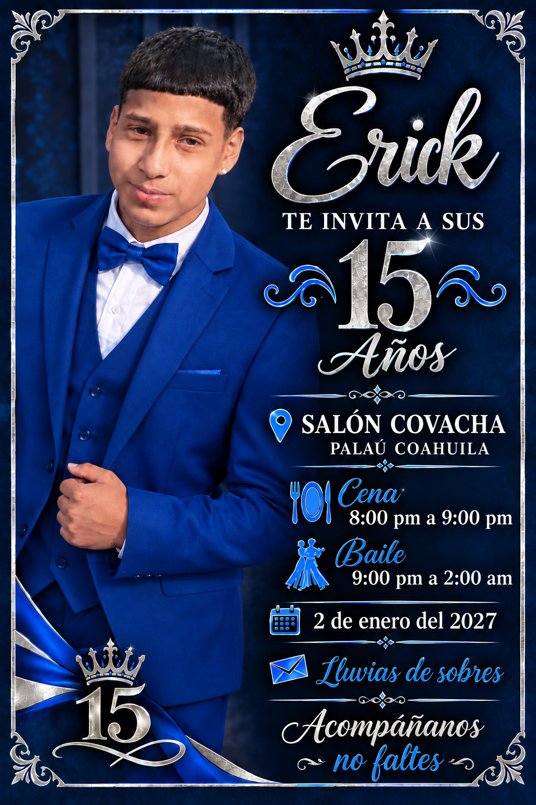

DOCTYPE html>
<html lang="es">
<head>
<meta charset="UTF-8">
<meta name="viewport" content="width=device-width, initial-scale=1.0">
<title>XV Años de Erick</title>

</head>

<body>

♛

<h1>Erick</h1>

<h2>Mis XV Años</h2>

✨ 2 de enero del 2027 ✨

<b>📍 Lugar</b>
Salón Covacha 
Palau, Coahuila, México

<b>🍽️ Cena</b>
8:00 pm a 9:00 pm

<b>💃 Baile</b>
9:00 pm a 2:00 am

<b>✉️ Regalo</b>
Lluvia de sobres

<a class="boton" href="#invitacion">
💌 Ver invitación
</a>

<a class="boton"
href="https://www.google.com/maps/search/?api=1&query=Salon+Covacha+Palau+Coahuila"
target="_blank">
📍 Ver ubicación
</a>

 

<a class="boton"
href="https://wa.me/52TU_NUMERO?text=Hola%2C%20quiero%20confirmar%20mi%20asistencia%20a%20los%20XV%20de%20Erick."
target="_blank">
✅ Confirmar asistencia
</a>

Acompáñanos 💙 
¡No faltes!

</body>
</html
